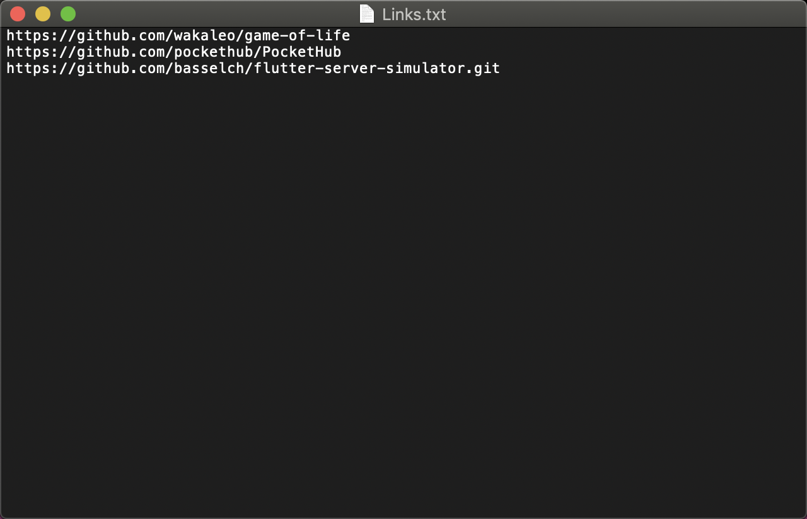
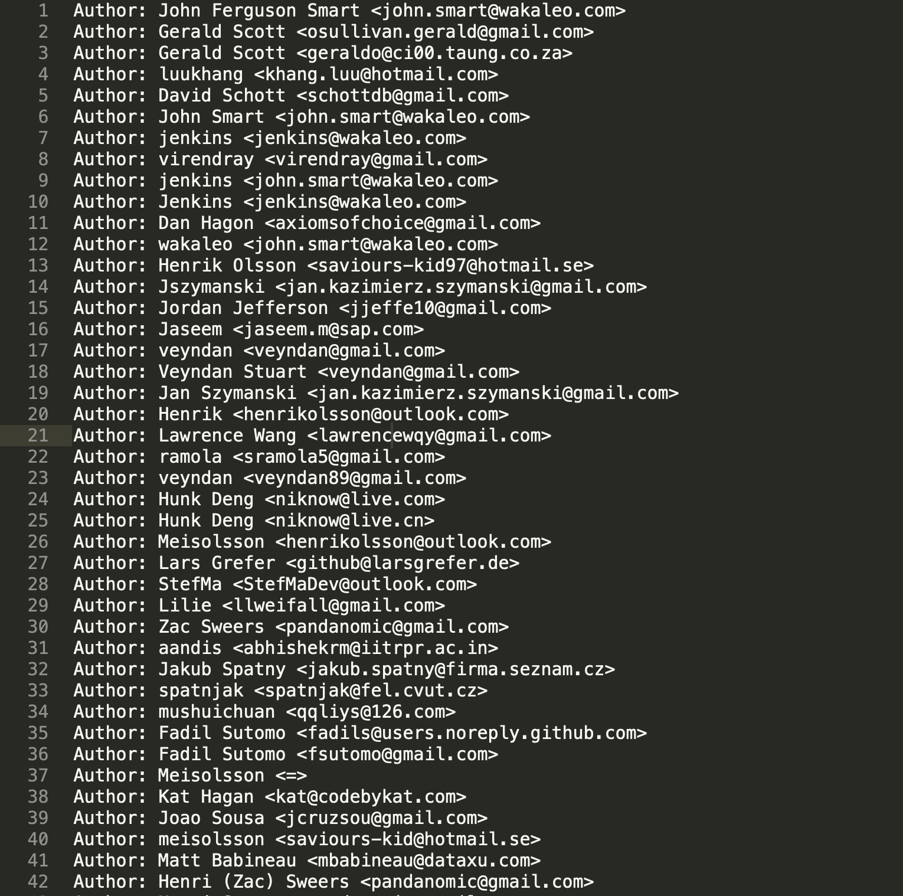

# Shell Script

### The soul purpose of this project, is to clone provided links repositories from GitHub and to gather specific data about developers who commited to this repositories based on their email address, and save them in a .txt file.

#### Provide the Links.txt file with the repository links.
Please leave an extra empty line after the last link



#### Or add you own .txt file with correct links in the .sh File, in the specified line


#### In Order to run the script, write : 

```bash
./EmailCollection.sh
```


#### And a file will be created containing all email addresses of people who comitted to the given repository in the Links.txt file.
Code can be modified to save emails based on developers name. Not like in this case based on developer Email.


### Data will be saved in the following way:


